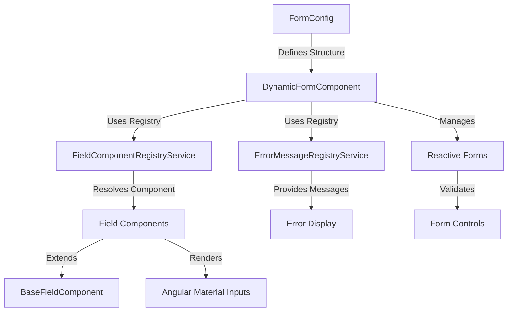
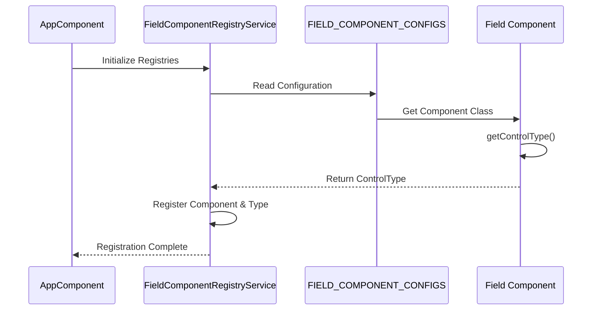
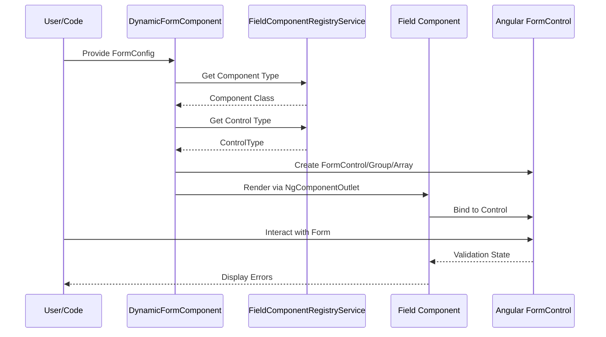
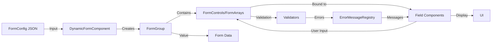

# Dynamic Forms Application

A comprehensive Angular application demonstrating a fully dynamic, configuration-driven form system. This project showcases how to build flexible, reusable form components that can be generated entirely from JSON configuration, without hardcoding form structures.

> **Note**: This project serves as a study case for AI-assisted code development, demonstrating how modern AI tools can be effectively used to build complex, production-ready applications with proper architecture, documentation, and best practices.

## Table of Contents

- [Overview](#overview)
- [Features](#features)
- [Architecture](#architecture)
- [Getting Started](#getting-started)
- [Usage](#usage)
- [Project Structure](#project-structure)
- [Component System](#component-system)
- [Registry System](#registry-system)
- [Form Configuration](#form-configuration)
- [Development](#development)

## Overview

The Dynamic Forms Application is built with Angular and provides a powerful, type-safe system for creating forms dynamically from configuration objects. Instead of writing HTML templates for each form, you define the form structure in TypeScript/JSON, and the system automatically generates the appropriate form controls and renders the corresponding input components.

### Key Concepts

- **Configuration-Driven**: Forms are defined entirely through configuration objects
- **Type-Safe**: Full TypeScript support with proper typing throughout
- **Extensible**: Easy to add new field types and custom validators
- **Decoupled**: Field components are registered dynamically, no direct imports needed
- **Reactive**: Built on Angular Reactive Forms with signal-based state management

## Features

- ✅ **10+ Field Types**: Text, Email, Number, Date, Password, Textarea, Select, Radio, Checkbox, and Subform
- ✅ **Nested Forms**: Support for subforms (FormArray) with drag-and-drop reordering
- ✅ **Dynamic Validation**: Built-in and custom validators with centralized error messages
- ✅ **Pre-filled Forms**: Set initial form values programmatically
- ✅ **Accessibility**: ARIA attributes and proper semantic HTML
- ✅ **Material Design**: Beautiful UI using Angular Material components
- ✅ **Type Safety**: Full TypeScript support with strict typing
- ✅ **Modern Angular**: Uses signals, standalone components, and latest Angular features

## Architecture

### High-Level Architecture



### Component Registration Flow



### Form Rendering Flow



### Data Flow



## Getting Started

### Prerequisites

- Node.js (v18 or higher)
- npm or yarn
- Angular CLI (v16 or higher)

### Installation

1. Clone the repository:
```bash
git clone <repository-url>
cd dynamic-forms-app
```

2. Install dependencies:
```bash
npm install
```

3. Start the development server:
```bash
ng serve
```

4. Navigate to `http://localhost:4200/`

## Usage

### Basic Form Configuration

```typescript
import { FormConfig } from './models/form-config.model';

const formConfig: FormConfig = {
  name: 'User Registration',
  fields: [
    {
      name: 'firstName',
      type: 'text',
      required: true,
      label: 'First Name',
      placeholder: 'Enter your first name',
      config: {
        minLength: 2,
        maxLength: 50
      }
    },
    {
      name: 'email',
      type: 'email',
      required: true,
      label: 'Email Address',
      placeholder: 'your.email@example.com'
    },
    {
      name: 'age',
      type: 'number',
      required: false,
      label: 'Age',
      config: {
        min: 18,
        max: 100
      }
    }
  ]
};
```

### Using the Dynamic Form Component

```html
<app-dynamic-form [formConfig]="formConfig"></app-dynamic-form>
```

### Pre-filling Form Values

```typescript
const formValues = {
  firstName: 'John',
  email: 'john@example.com',
  age: 30
};
```

```html
<app-dynamic-form 
  [formConfig]="formConfig"
  [formValues]="formValues">
</app-dynamic-form>
```

### Subform Example

```typescript
const formConfig: FormConfig = {
  name: 'Employee Form',
  fields: [
    {
      name: 'addresses',
      type: 'subform',
      required: true,
      label: 'Addresses',
      config: {
        formConfig: {
          name: 'Address Form',
          fields: [
            { name: 'street', type: 'text', required: true, label: 'Street' },
            { name: 'city', type: 'text', required: true, label: 'City' },
            { name: 'zipCode', type: 'text', required: true, label: 'ZIP Code' }
          ]
        },
        minItems: 1,
        maxItems: 5,
        allowDragDrop: true,
        getItemDescription: (formGroup, index) => {
          const street = formGroup.get('street')?.value || '';
          const city = formGroup.get('city')?.value || '';
          return `${street}, ${city}`;
        }
      }
    }
  ]
};
```

## Project Structure

```
dynamic-forms-app/
├── src/
│   ├── app/
│   │   ├── app.component.ts          # Root component
│   │   ├── dynamic-form/              # Main form system
│   │   │   ├── dynamic-form.component.ts
│   │   │   ├── field-components/      # Field component library
│   │   │   │   ├── base-field.component.ts
│   │   │   │   ├── field-component-registry.service.ts
│   │   │   │   ├── error-message-registry.service.ts
│   │   │   │   ├── field-component.config.ts
│   │   │   │   ├── error-message.config.ts
│   │   │   │   ├── text-input/
│   │   │   │   ├── email-input/
│   │   │   │   ├── number-input/
│   │   │   │   ├── subform-input/
│   │   │   │   └── ... (other field types)
│   │   ├── form-examples/             # Example forms
│   │   └── models/
│   │       └── form-config.model.ts   # Type definitions
│   └── styles.css
├── angular.json
├── package.json
└── README.md
```

## Component System

### Base Field Component

All field components extend `BaseFieldComponent`, which provides:

- Common input signals (field, formGroup, formControl, etc.)
- Computed properties (fieldId, label, placeholder, required)
- Accessibility support (ariaDescribedBy)
- Control type definition (`getControlType()`)

### Field Component Interface

```typescript
interface FieldComponent {
  field: FormField;              // Field configuration
  formGroup: FormGroup;          // Parent form group
  formControl: AbstractControl;  // The form control instance
  isInvalid: boolean;            // Validation state
  formId: string;                // Unique form identifier
}
```

### Creating a Custom Field Component

1. **Extend BaseFieldComponent**:
```typescript
@Component({...})
export class CustomInputComponent extends BaseFieldComponent {
  override getControlType(): ControlType {
    return 'control';
  }
}
```

2. **Register in Configuration**:
```typescript
// field-component.config.ts
export const FIELD_COMPONENT_CONFIGS: FieldComponentConfig[] = [
  // ... existing configs
  { type: 'custom', component: CustomInputComponent, controlType: 'control' }
];
```

3. **Add to FieldType**:
```typescript
// form-config.model.ts
export type FieldType = 
  | 'text'
  | 'custom'  // Add your new type
  | ...;
```

## Registry System

### Field Component Registry

The `FieldComponentRegistryService` maintains a map of field types to component classes and control types. It uses lazy initialization to register components on first access.

**Key Methods**:
- `get(fieldType)`: Get component class for a field type
- `getControlType(fieldType)`: Get control type for a field type
- `has(fieldType)`: Check if a component is registered

### Error Message Registry

The `ErrorMessageRegistryService` provides centralized error message generation for validation errors.

**Key Methods**:
- `getErrorMessage(errorKey, errors, fieldLabel)`: Get formatted error message
- `register(errorKey, messageFunction)`: Register custom error message

## Form Configuration

### FormField Interface

```typescript
interface FormField {
  name: string;                    // Required: Unique field identifier
  type: FieldType;                 // Required: Field type
  required?: boolean;               // Optional: Defaults to false
  config?: Record<string, unknown>; // Optional: Component-specific config
  validators?: ValidatorFn | ValidatorFn[]; // Optional: Custom validators
  label?: string;                   // Optional: Display label
  placeholder?: string;             // Optional: Input placeholder
}
```

### FormConfig Interface

```typescript
interface FormConfig {
  name: string;      // Form display name
  fields: FormField[]; // Array of field configurations
}
```

## Development

### Build

```bash
ng build
```

### Run Tests

```bash
ng test
```

### Code Generation

```bash
ng generate component component-name
```

## AI-Assisted Development

This project was developed as a study case for AI-assisted software development. It demonstrates:

- **Iterative Development**: Features were built incrementally with AI assistance
- **Code Quality**: Modern Angular patterns, type safety, and best practices
- **Documentation**: Comprehensive JSDoc comments and this README
- **Architecture**: Well-structured, scalable, and maintainable codebase
- **Problem Solving**: Complex issues (drag-and-drop, form state management) solved collaboratively

The development process involved:
1. Defining requirements and architecture
2. Implementing features with AI assistance
3. Refactoring and optimization
4. Documentation and testing
5. Continuous improvement based on feedback

This demonstrates how AI tools can accelerate development while maintaining high code quality and architectural integrity.

## License

This project is provided as-is for educational and demonstration purposes.
